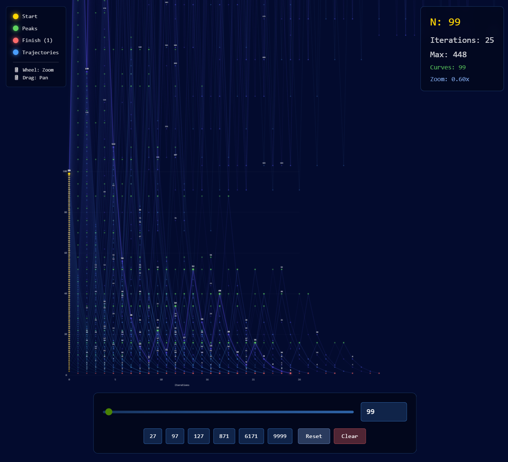

# Collatz Conjecture Visualization

An interactive visualization of the Collatz conjecture (also known as the 3n+1 problem) built with React and TypeScript. This tool allows you to explore the fascinating patterns that emerge from this simple mathematical sequence.



## What is the Collatz Conjecture?

The Collatz conjecture is one of mathematics' most famous unsolved problems. It involves a simple iterative process:

1. Start with any positive integer **n**
2. If **n** is even, divide it by 2
3. If **n** is odd, multiply it by 3 and add 1
4. Repeat the process with the resulting number

The conjecture states that no matter what positive integer you start with, you will always eventually reach 1.

For example, starting with n=6:
```
6 → 3 → 10 → 5 → 16 → 8 → 4 → 2 → 1
```

## Features

- **Interactive Visualization**: View the Collatz sequences for numbers from 1 to 9,999
- **Multiple Trajectories**: See all sequences from 1 to N displayed simultaneously
- **Zoom and Pan**: Use mouse wheel to zoom and drag to pan around the visualization
- **Real-time Statistics**: View iterations, max values, and number of curves displayed
- **Color-coded Nodes**:
  - 🟡 Gold: Starting point
  - 🟢 Green: Peak values in the sequence
  - 🔴 Red: Ending point (1)
  - 🔵 Blue: Trajectory lines
- **Quick Presets**: Jump to interesting numbers like 27, 97, 127, 871, 6171, and 9999
- **Responsive Design**: Works on different screen sizes

## Installation

This is a React component written in TypeScript (TSX). To use it in your project:

**Prerequisites:**
- React 16.8+ (requires Hooks support)
- TypeScript (optional, but recommended)

**Steps:**

1. Copy the `collatz-visualization.tsx` file to your React project
2. Import and use the component:

```tsx
import CollatzVisualization from './collatz-visualization';

function App() {
  return <CollatzVisualization />;
}
```

## Controls

- **Slider/Input Field**: Adjust the value of N to see sequences from 1 to N
- **Mouse Wheel**: Zoom in and out of the visualization
- **Click and Drag**: Pan around the canvas
- **Preset Buttons**: Click on preset numbers (27, 97, 127, 871, 6171, 9999) to jump to interesting sequences
- **Reset Button**: Reset zoom and pan to default view
- **Clear Button**: Clear the visualization and reset N to 1

## Technical Details

- **Framework**: React with Hooks (useState, useEffect, useRef)
- **Language**: TypeScript/TSX
- **Rendering**: HTML5 Canvas with high-DPI support
- **Maximum N**: 9,999 (configurable in code)
- **Maximum Iterations**: 10,000 per sequence (safety limit)

## How It Works

The visualization displays Collatz sequences as curves on a graph where:
- **X-axis**: Iteration number (step in the sequence)
- **Y-axis**: Value of the number at that iteration
- Each sequence is drawn with a unique color based on its starting number
- The currently selected number N is highlighted with a thicker, brighter line
- All sequences from 1 to N are displayed to show the overall pattern

## Interesting Numbers to Try

- **27**: Has 111 steps and reaches a maximum value of 9,232
- **97**: Shows a complex trajectory
- **127**: Demonstrates interesting peaks
- **871**: Long sequence with high peaks
- **6171**: One of the longest sequences under 10,000
- **9999**: Maximum allowed value in this visualization

## License

This project is open source and available for educational and personal use.
